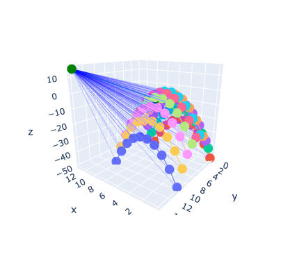
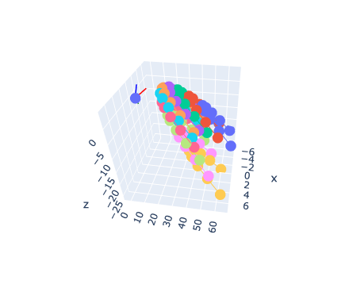

# Terrain Slicing and Projection Tool

Slice and project 3D terrain data onto a 2D plane. Primary motivation is to prepare terrain data for conversion to .svg/.gcode for use with pen plotters.

**Sample terrain ponts:**

**Camera focal point and view vector:**

**Points rotated to align view vector with positive y-axis:**

**Projection of points onto 2D 'sensor' plane behind camera focal point:**

## Roadmap

- [ ] Heightmap import (currently uses internally-generated sample data)
  - Terrain data can be exported using [Unreal PNG Heightmap](https://manticorp.github.io/unrealheightmap/index.html#latitude/35.02746615625006/longitude/-111.02285385131836/zoom/13/outputzoom/15/width/505/height/505)
  - [ ] Heightmap interpolation for slicing (necessary?)
- [x] Perspective (camera) definition
- [x] Reference frame conversion
  - [x] Translation (world > camera)
  - [x] Rotation of point cloud around camera origin to align axes
- [x] Projection onto 'sensor plane'
  - [x] Calculate points visible within bounds of camera frame
  - [x] Extract disjointed line segments into own slices
- [ ] Occlusion calculation
  - [x] Interpolate points on previous slice
  - [ ] Compare height of interpolate with assessed point
  - [ ] Discard occluded/extract visible points
- [ ] Investigate .svg conversion
